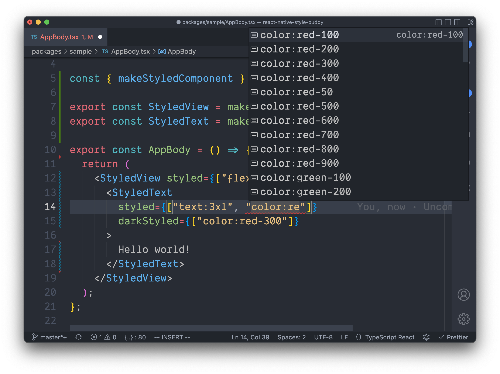

# React Native Style Buddy

## Introduction

React Native Style Buddy is a [TailwindCSS](https://tailwindcss.com/)-inspired styling library for React Native. Style Buddy aims to be your _style buddy_ by making your life easier when styling your next React Native app, offering a thorough set of styling helpers:

- thorough set of built-in styling utilities (spacing, colors, typography, etc.);
- extendable and overridable theming system;
- **type-safety** for speedy and confident development;
- dark-mode support out of the box.

Here's a snapshot of what you get to look forward to. Check out that sweet, sweet autocomplete. 🤤



## Installation

Install `react-native-style-buddy` using your favorite package registry tool:

```shell
npm install react-native-style-buddy # npm, or
yarn add react-native-style-buddy # yarn, or
pnpm add react-native-style-buddy # pnpm
```

**Important!** Style Buddy's type-safety and style-name inference is possible due to [template literal types](https://www.typescriptlang.org/docs/handbook/2/template-literal-types.html) in TypeScript. Template literal types were released in TypeScript 4.1, and therefore for you to get type safety/inference – your project will need to be using at least `typescript: "4.1.0"`.


## Getting Started

Style Buddy consists of a core method `createStyleBuddy` that allows you to customize your theme, add some extra style handlers, and it will return styling helpers to make your life easier.

### Wrap your app in a `StyleProvider`

Start by wrapping your app in a `StyleProvider` instance, which is used by Style Buddy under the hood (for things such as dark mode support).

```tsx
// App.tsx
import { StyleProvider } from "react-native-style-buddy";

export const App = () => {
  return (
    <StyleProvider>
      {/* The rest of your app body... */}
    </StyleProvider>
  );
};
```

### Create helpers

 Then use the `createStyleBuddy` method to generate styling helpers.

```ts
import { createStyleBuddy } from "react-native-style-buddy";

const { styles, useStyles, makeStyledComponent } = createStyleBuddy();
```

### Styling elements

With your new styling utilities (see [Default Handlers](./docs/default-handlers.md) for more info on styling handlers you get out of the box), you can quickly style elements.

```tsx
import { createStyleBuddy } from "react-native-style-buddy";
import { View } from "react-native";

const { styles, useStyles, makeStyledComponent } = createStyleBuddy();

// Use styles anywhere to generate a style object
const Component1 = () => {
  return <View style={styles("w:4", "h:8", "bg:red-300")} />;
};

// Or use useStyles to generate a style object with dark-mode support
const Component2 = () => {
  const viewStyles = useStyles({
    baseStyles: ["w:4", "h:8", "bg:red-300"],
    darkStyles: ["bg:red-800"]
  });
  
  return <View style={viewStyles} />;
};

// Or, generate a reusable styled component for easy application of styles
const StyledView = makeStyledComponent(View);
const Component3 = () => {
  return <StyledView classes={["w:4", "h:8", "bg:red-300"]} darkClasses={["bg:red-800"]} />;
};
```

### Customizing the theme

Style Buddy ships with a suite of [default handlers](./docs/default-handlers.md) that use the [default theme](./docs/default-theme.md) to create the applicable style "names" (such as `"w:4"`). This default theme is overridable and extendable. To override the default theme constraints, you can pass a `theme` argument to `createStyleBuddy`.

```ts
import { createStyleBuddy } from "react-native-style-buddy";

const { styles } = createStyleBuddy({
  theme: {
    spacing: { sm: 4, md: 8, lg: 16 }
  }
});

// Now the spacing helpers, like m: and p:, use the spacing constraints above.
styles("px:sm", "py:md", "m:lg");
```

Note that by passing a constraints field, such as `spacing` or `colors`, you'll override the respective default theme constraints. See [Extending the theme](./docs/extending-the-theme.md) for more details on how this works. If you want to just _extend_ the default theme constraints, use the `extendTheme` parameter.

```ts
import { createStyleBuddy } from "react-native-style-buddy";

const { styles } = createStyleBuddy({
  extendTheme: {
    colors: { primary: "#ff00ff" }
  }
});

// The default colors are available, alongside your added colors.
styles("color:red-300", "bg:primary");
```

### Adding style handlers

Style Buddy allows you to add your own custom style handlers, so you can break free from the default handlers and add your own if you so desire.

Each custom handler of the form `f: x => y` will generate a set of style names of the form `f:x`; each handler of the form `f: () => y` will generate a single style name `f`.

```ts
import { createStyleBuddy } from "react-native-style-buddy";

const { styles } = createStyleBuddy({
  // Add some extra handlers
  extraHandlers: {
    size: (x: "small" | "big") => ({ width: x === "small" ? 8 : 64 }),
    foo: () => ({ backgroundColor: "brown" })
  }
});

// You now have some additional style names
styles("size:small", "size:large", "foo");
```

## Recommended Usage

We recommend creating a _single_ Style Buddy instance for your entire application. This helps with consistency and caching. You might create a file with all-things Style Buddy, and export what you need from there.

```ts
// styles.ts
import { createStyleBuddy } from "react-native-style-buddy";
import { View, Text } from "react-native";

// Export helpers
export const { styles, useStyles, makeStyledComponent } = createStyleBuddy({ /* ... */ });

// Export some styled components for easy-user
export const StyledView = makeStyledComponent(View);
export const StyledText = makeStyledComponent(Text);
```

Then, throughout your app you can import style helpers from this file.

```tsx
// MySweetComponent.tsx
import * as React from "react";
import { StyledView, StyledText } from "./styles";

export const MySweetComponent = () => {
  return (
    <StyledView
      classes={["flex:1", "bg:red-100"]}
      darkClasses={["bg:red-800"]}
    >
      <StyledText
        classes={["text:3xl", "color:gray-800"]}
        darkClasses={["color:gray-200"]}
      >
        Hello world!
      </StyledText>
    </StyledView>
  )
};
```

And don't forget to wrap your application in a `StyleProvider` instance.

## Additional Guides

- [Default Handlers](./docs/default-handlers.md)
- [Default Theme](./docs/default-theme.md)
- [Extending the Theme](./docs/extending-the-theme.md)
- [Dynamic ClassName Lists](./docs/dynamic-classname-list.md)
- [Dark Mode Support](./docs/dark-mode.mdx)
- [Extending the Color Palette](./docs/extending-color-palette.md)
- API Reference
