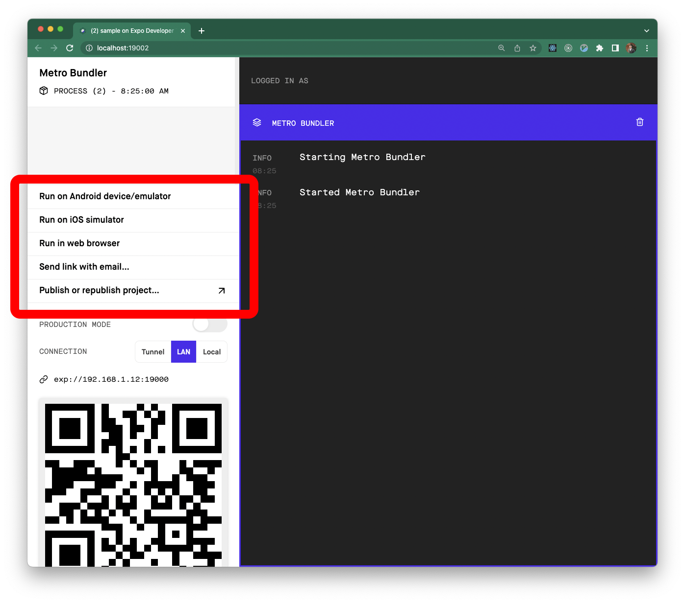

# Development Guide

This document will walk you through how to get the Zephyr repository setup for development/contribution.

## Clone the repo

Start by cloning the repo from GitHub:

```shell
git clone git@github.com:FormidableLabs/react-native-zephyr.git
```

## Install Dependencies

Next, install the required dependencies:

```shell
yarn install
```

This will install the dependencies required to build the core and to run the sample application.

## Start the development server(s)

If you want to work on just the core of Zephyr, run the following to start up the TSC development server:

```shell
yarn dev:core
```

If you want to run both the core development server _and_ the sample Expo application, ensure you have `expo-cli` installed globally (`npm i -g expo-cli`) and then run:

```shell
yarn dev
```

This will start the TypeScript compiler to watch changes to the core code, and spin up the sample Expo application.

If you check your terminal, you should see an Expo link (perhaps `localhost:19002`) that you can open, which will open an Expo web dashboard:



From this web dashboard, you can fire up the sample application in a simulator/emulator or on a physical device.

When in development mode, changes you make to the core will be compiled on the fly. The sample application is linked to the development build so you can test your changes in realtime in the sample application.

## Running tests

To run the unit test suite, run:

```shell
yarn test
```

If you want to run the test suite in watch mode (very handle when doing development), run:

```shell
yarn test:watch
```

If you want to run the CI static analysis/unit test suite locally on your machine, run:

```shell
yarn check:ci
```


## Documentation Website

The documentation site for Zephyr is contained in this repo, but not part of the Yarn workspaces (to keep the dependencies isolated). If you want to spin up the docs site locally, run the following:

```shell
cd website # navigate to the `website` directory
yarn install # install the website dependencies
yarn start # start the dev server for the docs
```

The `website` folder contains all of the [Docusaurus](https://docusaurus.io/)-related code (which builds/configures the actual docs site). If you want to make changes to the layout/format of the docs site, make them in the `website` directory.

The `docs` directory contains all of the actual content for the docs site. If you want to make content changes to the docs, make them in the `docs` directory.
