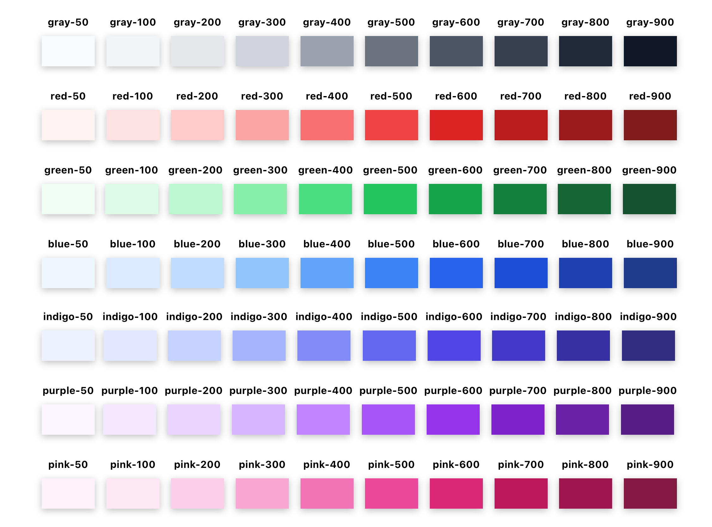
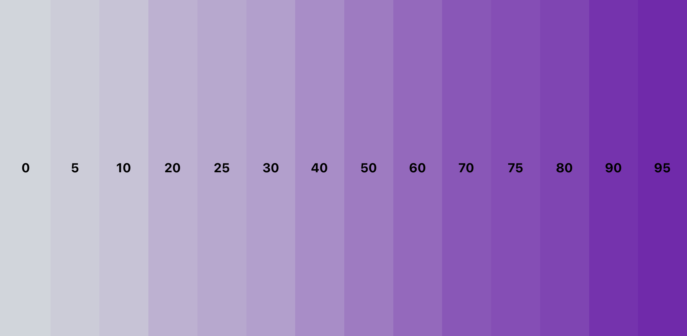
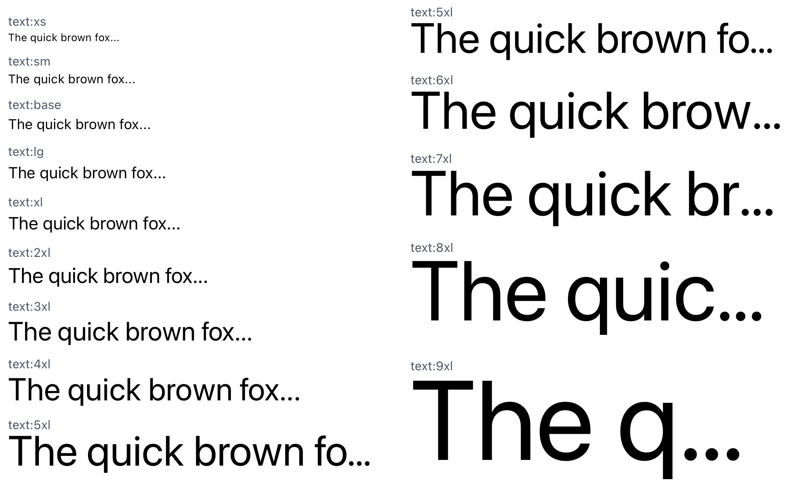
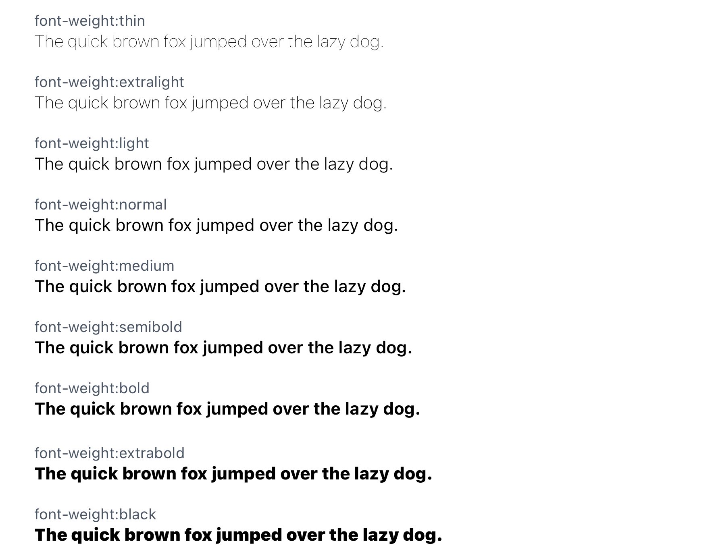

# Default Theme

Zephyr provides a set of default theme constraints, so you can start styling with zero configuration. You can easily customize/extend the theme (see [Extending the Theme](./extending-the-theme.md)), but don't have to to get started with Zephyr.

This document outlines the default theme provided out of the box. It is heavily inspired by [TailwindCSS](https://tailwindcss.com/)'s default theme, with some modifications appropriate for React Native. The code that defines this default theme can be [found here](https://github.com/FormidableLabs/react-native-zephyr/blob/master/packages/core/src/theme.ts).

## Default Spacing Constraints

The `spacing` constraints apply to anything space/size related, such as [the margin classes](./default-classes.md#margin), [the padding classes](./default-classes.md#padding), [the sizing classes](./default-classes.md#sizing), and [the positioning classes](./default-classes.md#positioning). Here's the scale for the default `sizing` constraints.

| Name                  | Size        |
|-----------------------|-------------|
| `0` (ex: `w:0`)       | 0           |
| `pt` (ex: `w:pt`)     | 1           |
| `0.5` (ex: `w:0.5`)   | 2           |
| `1` (ex: `w:1`)       | 4           |
| `1.5` (ex: `w:1.5`)   | 6           |
| `2` (ex: `w:2`)       | 8           |
| `2.5` (ex: `w:2.5`)   | 10          |
| `3` (ex: `w:3`)       | 12          |
| `3.5` (ex: `w:3.5`)   | 14          |
| `4` (ex: `w:4`)       | 16          |
| `5` (ex: `w:5`)       | 20          |
| `6` (ex: `w:6`)       | 24          |
| `7` (ex: `w:7`)       | 28          |
| `8` (ex: `w:8`)       | 32          |
| `9` (ex: `w:9`)       | 36          |
| `10` (ex: `w:10`)     | 40          |
| `11` (ex: `w:11`)     | 44          |
| `12` (ex: `w:12`)     | 48          |
| `14` (ex: `w:14`)     | 56          |
| `16` (ex: `w:16`)     | 64          |
| `20` (ex: `w:20`)     | 80          |
| `24` (ex: `w:24`)     | 96          |
| `28` (ex: `w:28`)     | 112         |
| `32` (ex: `w:32`)     | 128         |
| `36` (ex: `w:36`)     | 144         |
| `40` (ex: `w:40`)     | 160         |
| `48` (ex: `w:48`)     | 192         |
| `56` (ex: `w:56`)     | 224         |
| `64` (ex: `w:64`)     | 256         |
| `72` (ex: `w:72`)     | 288         |
| `80` (ex: `w:80`)     | 320         |
| `96` (ex: `w:96`)     | 384         |
| `1/4` (ex: `w:1/4`)   | `25%`       |
| `1/2` (ex: `w:1/2`)   | `50%`       |
| `3/4` (ex: `w:3/4`)   | `75%`       |
| `1/3` (ex: `w:1/3`)   | `33.33333%` |
| `2/3` (ex: `w:2/3`)   | `66.66666%` |
| `1/5` (ex: `w:1/5`)   | `20%`       |
| `2/5` (ex: `w:2/5`)   | `40%`       |
| `3/5` (ex: `w:3/5`)   | `60%`       |
| `4/5` (ex: `w:4/5`)   | `80%`       |
| `full` (ex: `w:full`) | `100%`      |

## Default Colors

The default colors consist of `white: #fff`, `black: #000`, and the following colors.

Check out the [Extending the Color Palette](./extending-color-palette.md) for information on how to extend this color palette with other pre-defined colors borrowed from TailwindCSS's palette.

## Default Opacities

The `opacities` constraint applies to opacity and background opacity (which is opacity applied _only_ to the background, not all elements). Here's the default `opacities` constraint scale.

| Name | Value |
|------|-------|
| `0`  | 0     |
| `5`  | 0.05  |
| `10` | 0.1   |
| `20` | 0.2   |
| `25` | 0.25  |
| `30` | 0.3   |
| `40` | 0.4   |
| `50` | 0.5   |
| `60` | 0.6   |
| `70` | 0.7   |
| `75` | 0.75  |
| `80` | 0.8   |
| `90` | 0.9   |
| `95` | 0.95  |

Here's a visual representation of that scale.

## Default Border Sizes

The `borderSizes` theme constraint applies to [the border width classes](./default-classes.md#borders-width-color-radius). The scale for this is:

| Name       | Size                       |
|------------|----------------------------|
| `0`        | 0                          |
| `hairline` | `StyleSheet.hairlineWidth` |
| `1`        | 1                          |
| `2`        | 2                          |
| `4`        | 4                          |
| `8`        | 8                          |

Here's a visual representation of that scale.

## Default Border Radii

The `borderRadii` constraint applies to [the border radius classes](./default-classes.md#borders-width-color-radius). The scale is based off of [the base font size](./extending-the-theme.md#changing-the-base-font-size) for the default constraints, which is `baseFontSize = 14`. The scale is as follows:

| Name   | Size                   |
|--------|------------------------|
| `none` | `0`                    |
| `sm`   | `0.125 * baseFontSize` |
| `base` | `0.25 * baseFontSize`  |
| `md`   | `0.375 * baseFontSize` |
| `lg`   | `0.5 * baseFontSize`   |
| `xl`   | `0.75 * baseFontSize`  |
| `2xl`  | `baseFontSize`         |
| `3xl`  | `1.5 * baseFontSize`   |
| `full` | `999`                  |

Here's a visual representation of that scale.

## Default Font Sizes

The `fontSizes` constraint applies to [the font size classes](./default-classes.md#text-styling). The scale is based off of [the base font size](./extending-the-theme.md#changing-the-base-font-size) for the default constraints, which is `baseFontSize = 14`. The scale is as follows:

| Name   | Size                                          |
|--------|-----------------------------------------------|
| `xs`   | `[0.75 * baseFontSize, baseFontSize]`         |
| `sm`   | `[0.875 * baseFontSize, 1.25 * baseFontSize]` |
| `base` | `[baseFontSize, 1.5 * baseFontSize]`          |
| `lg`   | `[1.125 * baseFontSize, 1.75 * baseFontSize]` |
| `xl`   | `[1.25 * baseFontSize, 1.75 * baseFontSize]`  |
| `2xl`  | `[1.5 * baseFontSize, 2 * baseFontSize]`      |
| `3xl`  | `[1.875 * baseFontSize, 2.25 * baseFontSize]` |
| `4xl`  | `[2.25 * baseFontSize, 2.5 * baseFontSize]`   |
| `5xl`  | `[3 * baseFontSize, 3 * baseFontSize]`        |
| `6xl`  | `[3.75 * baseFontSize, 3.75 * baseFontSize]`  |
| `7xl`  | `[4.5 * baseFontSize, 4.5 * baseFontSize]`    |
| `8xl`  | `[6 * baseFontSize, 6 * baseFontSize]`        |
| `9xl`  | `[8 * baseFontSize, 8 * baseFontSize]`        |

Here's a visual representation of that scale.

## Default Font Weights

The `fontWeights` constraint applies to [the font weight classes](./default-classes.md#text-styling). The scale for this is:

| Name         | Value |
|--------------|-------|
| `thin`       | 100   |
| `extralight` | 200   |
| `light`      | 300   |
| `normal`     | 400   |
| `medium`     | 500   |
| `semibold`   | 600   |
| `bold`       | 700   |
| `extrabold`  | 800   |
| `black`      | 900   |

Here's a visual representation of that scale.

## Default Shadows

The `shadows` constraint applies to [the shadow classes](./default-classes.md#shadows). The scale for this is:

| Name   | Value                                       |
|--------|---------------------------------------------|
| `sm`   | `{ android: 1, ios: [0, 1, 1, 0.18] }`      |
| `base` | `{ android: 2, ios: [0, 1, 1.41, 0.2] }`    |
| `md`   | `{ android: 5, ios: [0, 2, 3.84, 0.25] }`   |
| `lg`   | `{ android: 8, ios: [0, 4, 4.65, 0.3] }`    |
| `xl`   | `{ android: 12, ios: [0, 6, 7.49, 0.37] }`  |
| `2xl`  | `{ android: 16, ios: [0, 8, 10.32, 0.44] }` |

Here's a visual representation of that scale.

## Default Aspect Ratios

The `aspectRatios` constraint applies to the aspect ratio classes. The scale for this is as follows, where `[16, 9]` represents a 16-9 aspect ratio.

| Name   | Value     |
|--------|-----------|
| `1`    | `[1, 1]`  |
| `16-9` | `[16, 9]` |
| `9-16` | `[9, 16]` |
| `3-4`  | `[3, 4]`  |
| `4-3`  | `[4, 3]`  |
| `1-2`  | `[1, 2]`  |
| `2-1`  | `[2, 1]`  |

Here's a visual representation of that scale.

